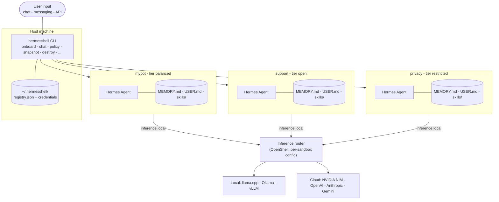

<p align="center">
  
</p>

<p align="center">
  <a href="https://github.com/ppritcha/hermesshell/actions/workflows/ci.yml"></a>
  <a href="https://github.com/ppritcha/hermesshell/blob/main/LICENSE"></a>
  <a href="https://github.com/ppritcha/hermesshell/blob/main/CONTRIBUTING.md"></a>
  <a href="https://github.com/ppritcha/hermesshell/blob/main/CHANGELOG.md"></a>
</p>

**Hermes Agent (NousResearch) running inside NVIDIA OpenShell.**

OpenShell is NVIDIA's kernel-level sandbox for AI agents — it gates every outbound network call, filesystem touch, and risky syscall from outside the agent's process, so a compromised tool or skill cannot punch through. HermesShell drops NousResearch's Hermes Agent into that sandbox and adds a multi-sandbox lifecycle CLI, composable policy presets, and persistent per-sandbox memory on top. Hermes keeps its full toolset; the kernel keeps the blast radius bounded.

---

## Table of Contents

- [Architecture](#architecture)
- [Quick Start](#quick-start)
  - [Recommended — one-command install](#recommended--one-command-install)
  - [Build from source](#build-from-source-if-you-want-to-modify-hermesshell-itself)
  - [OpenShell sandbox (full hardware enforcement)](#openshell-sandbox-full-hardware-enforcement)
- [What OpenShell Enforces](#what-openshell-enforces)
- [Policy Tiers & Presets](#policy-tiers--presets)
- [Hermes Features](#hermes-features-inside-the-sandbox)
- [Skills Library](#skills-library)
- [Use Cases](#use-cases)
- [HermesShell vs NemoClaw](#hermesshell-vs-nemoclaw)
- [CLI Reference](#hermesshell-cli)
- [Personalise Hermes](#personalise-hermes)
- [Project Structure](#project-structure)
- [Diagnostics & Testing](#diagnostics--testing)
- [Contributing](#contributing)
- [Related Projects](#related)

---

## Architecture

The `hermesshell` CLI runs on the host and manages a fleet of isolated Hermes sandboxes — each with its own persona, credentials, persistent memory, skills, and policy tier. OpenShell wraps every sandbox with Landlock (filesystem), seccomp (syscalls), and an OPA + L7 proxy (network egress). Inside the sandbox, the agent talks to a single virtual endpoint, `inference.local`; OpenShell intercepts that call and routes it to whichever backend each sandbox was configured for. Hermes never knows it is sandboxed.



---

## Quick Start

### Recommended — one-command install

Clones the repo to `~/.hermesshell`, installs Node.js (via nvm) if needed, builds the `hermesshell` CLI, and launches the interactive **onboard wizard** which walks you through provider selection, model configuration, policy tier, and sandbox creation:

```bash
curl -fsSL https://raw.githubusercontent.com/ppritcha/hermesshell/main/scripts/install.sh | bash
```

Prerequisites: `docker`, `git`, `curl`. Docker Desktop (macOS / Windows) or `dockerd` (Linux) must be running. Node.js >= 20 is installed automatically if missing.

The onboard wizard configures everything interactively. Once complete:

```bash
hermesshell mybot chat "hello"
hermesshell list                    # see all sandboxes
hermesshell mybot snapshot create   # point-in-time backup
```

To re-run onboard later (e.g. switch providers): `hermesshell onboard`.

---

### Build from source (if you want to modify HermesShell itself)

```bash
git clone https://github.com/ppritcha/hermesshell
cd hermesshell
cd cli && npm install && npm run build && npm link && cd ..
hermesshell onboard
```

---

### OpenShell sandbox (full hardware enforcement)

Requires Linux + NVIDIA GPU + OpenShell installed.

```bash
# Install OpenShell (requires NVIDIA account)
curl -fsSL https://www.nvidia.com/openshell.sh | bash

# Install HermesShell via the one-liner above — the onboard wizard
# detects OpenShell and configures the sandbox automatically.
hermesshell mybot chat "hello"
hermesshell list                                 # see all sandboxes
hermesshell mybot snapshot create                # point-in-time backup
```

Full CLI reference: [hermesshell CLI](#hermesshell-cli). Diagnostics: `hermesshell doctor`.

---

## What OpenShell Enforces


| Layer          | Mechanism                | Rule                                                                       |
| -------------- | ------------------------ | -------------------------------------------------------------------------- |
| **Network**    | OPA + HTTP CONNECT proxy | Egress to approved hosts only — all else blocked                           |
| **Filesystem** | Landlock LSM             | `~/.hermes/` + `/sandbox/` + `/tmp/` only                                  |
| **Process**    | Seccomp BPF              | `ptrace`, `mount`, `kexec_load`, `perf_event_open`, `process_vm_`* blocked |
| **Inference**  | Privacy router           | Credentials stripped from agent; backend credentials injected by OpenShell |


All four layers are enforced **out-of-process** — even a fully compromised Hermes instance cannot override them.

---

## Policy Tiers & Presets

The onboard wizard selects a **policy tier** which determines the default set of network presets. You can add or remove individual presets at any time **without restarting** the sandbox:

```bash
hermesshell mybot policy add github     # allow GitHub API access
hermesshell mybot policy remove slack   # revoke Slack access
hermesshell mybot policy list           # show active presets
```

### Tiers (selected during onboard)


| Tier         | Default Presets                       | Description                                 |
| ------------ | ------------------------------------- | ------------------------------------------- |
| `restricted` | *(none)*                              | Inference only — no external network access |
| `balanced`   | npm, pypi, huggingface, brave, github | Development + research                      |
| `open`       | balanced + slack, discord, telegram   | Full messaging + development                |


### Available Presets


| Preset        | Access Granted                |
| ------------- | ----------------------------- |
| `npm`         | npm / Yarn registries         |
| `pypi`        | PyPI package index            |
| `huggingface` | Hugging Face Hub + CDN        |
| `brave`       | Brave Search API              |
| `github`      | GitHub API + raw content      |
| `slack`       | Slack API + websocket gateway |
| `discord`     | Discord API + gateway + CDN   |
| `telegram`    | Telegram Bot API              |


Presets are composable YAML fragments in `openshell/presets/`. Each is merged with `openshell/baseline.yaml` to produce the active policy.

---

## Hermes Features Inside the Sandbox


| Feature                                 | Status | Notes                                                                              |
| --------------------------------------- | ------ | ---------------------------------------------------------------------------------- |
| `hermes chat`                           | ✅      | Routes via `inference.local` → configured backend (Ollama, llama.cpp, NIM, …)      |
| Persistent state under `~/.hermes/`     | ✅      | `SOUL.md`, `memories/MEMORY.md`, `memories/USER.md`, skills, sessions; survives sandbox recreation |
| Skills library                          | ✅      | Stored in `~/.hermes/skills/`; manage with `hermes skills`                         |
| Built-in toolsets                       | ✅      | `web`, `browser`, `terminal`, `file`, `code_execution`, `vision`, `image_gen`, … (`hermes tools`) |
| Cron / scheduled tasks                  | ✅      | `hermes cron create`                                                               |
| MCP server integration                  | ✅      | `hermes mcp` (`add` / `list` / `serve`)                                            |
| IDE integration (ACP)                   | ✅      | `hermes acp` — VS Code, Zed, JetBrains                                             |
| Python SDK                              | ✅      | `from run_agent import AIAgent`                                                    |
| Telegram / Discord                      | ✅      | `open` tier (includes `telegram` + `discord` presets); integrate via `hermes gateway` |
| Slack                                   | ✅      | `open` tier (includes `slack` preset); helpers via `hermes slack`                  |
| WhatsApp                                | ✅      | `hermes whatsapp`; add a custom egress policy for Meta endpoints (no built-in preset) |
| Web search                              | ✅      | `balanced` or `open` tier (`brave` preset → Brave Search API)                      |
| Voice notes (incoming messages)         | ✅      | Auto-transcribed by the `voice` built-in toolset before reaching the model         |


---

## Skills Library

Pre-built skills that encode recurring workflows. Install with one command, invoke via chat:

```bash
./skills/install.sh research-digest     # weekly arXiv digest → Telegram
./skills/install.sh code-review         # local code review (CLI or VS Code ACP)
./skills/install.sh anomaly-detection   # daily DB anomaly detection → Slack/Telegram
./skills/install.sh market-alerts       # watchlist price alerts → Telegram
./skills/install.sh slack-support       # Slack support bot with knowledge base
./skills/install.sh home-assistant      # natural language smart home control
./skills/install.sh --all               # install everything
```

After installing, invoke from chat or any connected messaging platform:

```bash
hermesshell mybot chat "run research-digest"
# or in Telegram: "run the anomaly-detection skill"
```

Full index: [skills/README.md](skills/)

---

## Use Cases

Seven end-to-end guides covering real deployment scenarios — each with prerequisites, setup steps, automated tests, and a NemoClaw comparison:


| Who                 | Setup                                           | Guide                                                        |
| ------------------- | ----------------------------------------------- | ------------------------------------------------------------ |
| Researcher / writer | Docker + Telegram + weekly arXiv digest         | [01-researcher](docs/use-cases/01-researcher/)               |
| Developer           | Docker + VS Code ACP                            | [02-developer](docs/use-cases/02-developer/)                 |
| Home automation     | Docker + Home Assistant MCP + Telegram          | [03-home-automation](docs/use-cases/03-home-automation/)     |
| Data analyst        | Docker + Postgres MCP + anomaly alerts          | [04-data-analyst](docs/use-cases/04-data-analyst/)           |
| Small business      | Docker + Slack support bot + knowledge base     | [05-small-business](docs/use-cases/05-small-business/)       |
| Privacy-regulated   | OpenShell sandbox + strict policy (HIPAA/legal) | [06-privacy-regulated](docs/use-cases/06-privacy-regulated/) |
| Trader / quant      | Docker + local model + Telegram price alerts    | [07-trader](docs/use-cases/07-trader/)                       |


Full index and NemoClaw compatibility table: [docs/use-cases/](docs/use-cases/)

---

---

## hermesshell CLI

Sandboxes are named. Use `hermesshell <name> <command>` or omit the name to use the default.

```
GLOBAL COMMANDS
  hermesshell onboard                    First-time setup wizard (provider, model, policy, sandbox)
  hermesshell list                       List registered sandboxes
  hermesshell backup-all                 Snapshot every registered sandbox
  hermesshell doctor [--quick]           End-to-end diagnostic
  hermesshell credentials [list|reset]   Manage stored API keys
  hermesshell version                    Print version
  hermesshell uninstall                  Remove HermesShell (data preserved)

SANDBOX COMMANDS  (hermesshell [<name>] <command>)
  start [--gpu]                         Create and start sandbox via OpenShell
  stop                                  Stop sandbox (memories + skills preserved)
  status                                Show inference config + memory/skill counts
  connect                               Open interactive shell inside sandbox
  logs [--follow]                       Stream sandbox logs
  destroy                               Remove sandbox (memories preserved in snapshots)
  chat "prompt"                         One-shot message to Hermes

POLICY COMMANDS  (hermesshell [<name>] policy <subcommand>)
  policy list                           Show active presets for this sandbox
  policy add PRESET                     Enable a network preset (e.g. github, slack)
  policy remove PRESET                  Disable a network preset

LIFECYCLE COMMANDS  (hermesshell [<name>] <command>)
  snapshot [create|list|restore [PREFIX]]  Manage point-in-time snapshots
  backup                                Alias for snapshot create
  restore [PREFIX]                      Alias for snapshot restore
  rebuild                               Snapshot → destroy → recreate → restore

EXAMPLES
  hermesshell onboard
  hermesshell mybot chat "Hello Hermes"
  hermesshell mybot policy add github
  hermesshell mybot snapshot create
  hermesshell mybot rebuild
  hermesshell list
  hermesshell backup-all
```

---

## Personalise Hermes

```bash
cp configs/persona.yaml.example configs/persona.yaml
```

Edit `configs/persona.yaml` — set your name, role, expertise, ticker watchlist, and response style. Hermes loads this into every session. For deeper personalisation, edit `~/.hermes/SOUL.md` — this goes directly into the system prompt.

---

## Project Structure

```
hermesshell/
├── .github/
│   └── workflows/
│       └── ci.yml                      # Syntax, lint, and test CI
├── Dockerfile                          # Hermes Agent (pinned base image + build ARGs)
├── .env.example                        # CTX_SIZE (llama-server only, ignored by Ollama), bot tokens
├── cli/                                # Node.js/TypeScript CLI (hermesshell command)
│   ├── package.json                   # hermesshell npm package
│   ├── tsconfig.json
│   ├── vitest.config.ts
│   └── src/
│       ├── index.ts                   # Commander entry point
│       ├── commands/                  # onboard, chat, policy, doctor, etc.
│       └── lib/                       # registry, credentials, policy, providers, etc.
├── openshell/
│   ├── baseline.yaml                  # Base sandbox policy (filesystem, process, inference)
│   ├── tiers.yaml                     # Tier definitions (restricted, balanced, open)
│   ├── presets/                       # Composable network presets
│   │   ├── npm.yaml                   # npm / Yarn registries
│   │   ├── pypi.yaml                  # PyPI
│   │   ├── brave.yaml                 # Brave Search API
│   │   ├── huggingface.yaml           # Hugging Face Hub
│   │   ├── github.yaml                # GitHub API
│   │   ├── slack.yaml                 # Slack API + websocket
│   │   ├── discord.yaml               # Discord API + gateway
│   │   └── telegram.yaml              # Telegram Bot API
│   ├── hermesshell-policy.yaml         # Legacy default policy
│   └── hermesshell-profile.yaml        # Sandbox profile
├── configs/
│   ├── hermes.yaml.example            # Full Hermes config
│   └── persona.yaml.example           # User persona
├── skills/
│   ├── install.sh                     # Skill installer
│   ├── anomaly-detection/             # DB anomaly detection (detect.py)
│   ├── market-alerts/                 # Price threshold alerts (monitor.py)
│   ├── code-review/                   # Code review prompts
│   ├── slack-support/                 # FAQ + escalation bot
│   ├── home-assistant/                # HA MCP control
│   └── research-digest/               # Weekly arXiv digest
├── scripts/
│   └── install.sh                     # One-command installer (curl | bash)
├── docs/
│   ├── use-cases/                     # 7 end-to-end use-case guides
│   └── features.md                    # Full feature reference
├── knowledge/                         # Drop documents here (RAG context, read-only mount)
└── models/                            # Drop .gguf model weights here
```

---

## Diagnostics & Testing

```bash
# Check your environment (provider-aware inference health, policy validation, etc.)
hermesshell doctor              # full diagnostic
hermesshell doctor --quick      # skip slow checks (chat smoke test, DNS probe)

# Run CLI unit tests
cd cli && npm test
```

---

## Contributing

HermesShell welcomes contributions — especially:

- **OpenShell policy corrections** — if you have access to a real OpenShell environment, correctness fixes are the highest-value contribution
- **New policy presets** — homeassistant, coding, research, etc.
- **New skills** — follow the `SKILL.md` format in any existing skill as a template
- **Real-world test reports** — if you've run HermesShell on NVIDIA hardware, share your `hermesshell doctor` output

**Quick contributor setup:**

```bash
git clone https://github.com/ppritcha/hermesshell
cd hermesshell
cd cli && npm install && npm test && cd ..   # build + test the CLI
hermesshell doctor --quick                    # verify your environment
```

Full guide: [CONTRIBUTING.md](CONTRIBUTING.md) · [Code of Conduct](CODE_OF_CONDUCT.md) · [Changelog](CHANGELOG.md)

---

## Related

- [HermesClaw](https://github.com/TheAiSingularity/hermesclaw) — Earlier sibling project exploring the same Hermes-on-OpenShell idea in bash. No longer actively maintained; HermesShell supersedes it.
- [Hermes Agent](https://github.com/NousResearch/hermes-agent) — NousResearch's agent (18k ⭐)
- [NemoClaw](https://github.com/NVIDIA/NemoClaw) — NVIDIA's OpenClaw + OpenShell reference implementation
- [OpenShell](https://docs.nvidia.com/openshell/latest/) — NVIDIA's hardware-enforced AI sandbox

